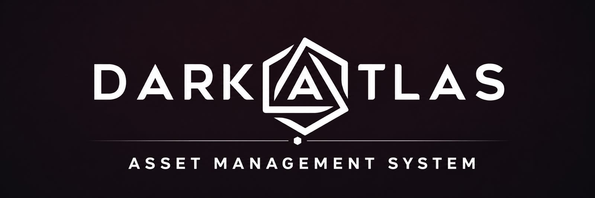
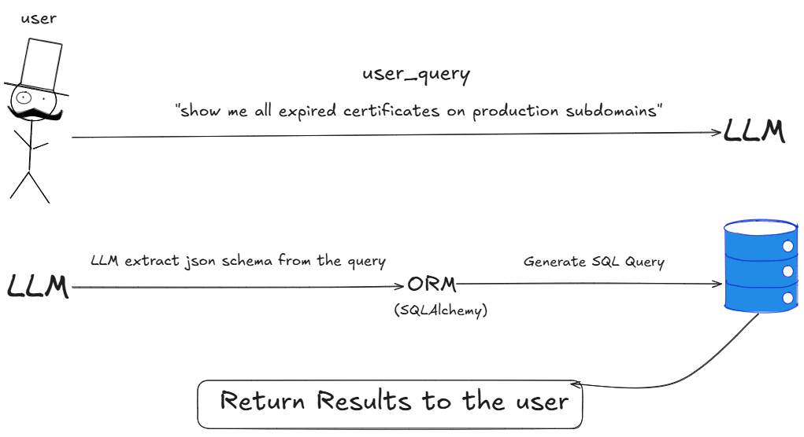
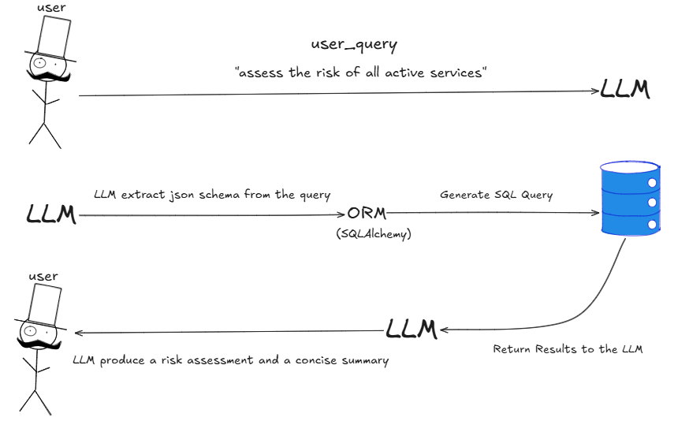
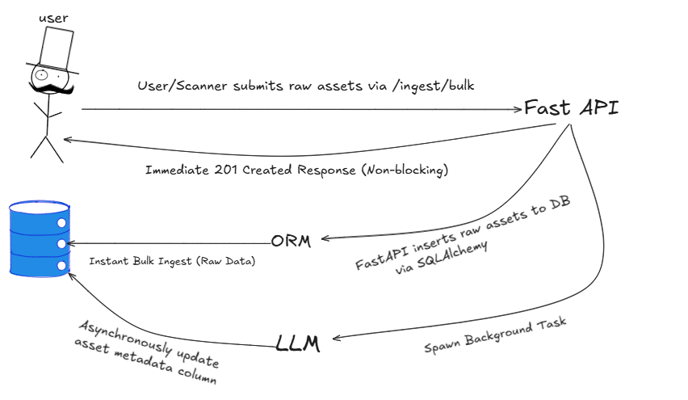
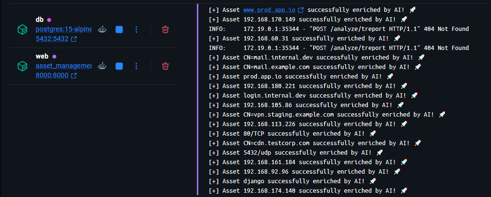
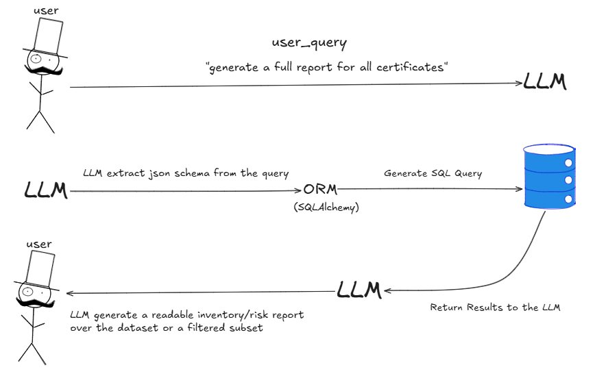

# DarkAtlas — Asset Management System (AI Applications Track)


## Table of Contents

1. [Project Overview](#1-project-overview)
2. [Project Structure](#2-project-structure)
3. [Installation & Setup](#3-installation--setup)
   - [Prerequisites](#prerequisites)
   - [Environment Variables](#environment-variables)
   - [Running with Docker](#running-with-docker)
   - [Accessing the Database](#accessing-the-database)
4. [AI Capabilities](#4-ai-capabilities)
   - [Natural-Language Asset Query](#41-natural-language-asset-query)
   - [Risk Scoring & Summarization](#42-risk-scoring--summarization)
   - [Automated Enrichment & Categorization](#43-automated-enrichment--categorization)
   - [Natural-Language Report Generation](#44-natural-language-report-generation)
5. [Data Modeling](#5-data-modeling)
   - [Organizations Model](#51-organizations-model)
   - [Asset Model](#52-asset-model)
   - [Relationships Graph](#53-relationships-graph)
   - [Asset Import Batches Model](#54-asset-import-batches-model)
   - [Database Schema Overview](#55-database-schema-overview)
6. [Design Decisions & Assumptions](#6-design-decisions--assumptions)
7. [Future Improvements](#7-future-improvements)


---

## 1. Project Overview

Security teams inherently struggle to track their external attack surface across hundreds of domains, IPs, certificates, and services. DarkAtlas solves this by creating a structured Asset Management module coupled with a secure RAG (Retrieval-Augmented Generation) analysis pipeline. 

This module serves as the heart of the platform and acts as the system of record. It is designed to ingest discovered assets, remove duplicates, track each asset's lifecycle and relationships, and expose everything for advanced querying, analysis, and reporting. 


---

## 2. Project Structure

```
D:\Asset_Management_System
├── .env.example          # Template for environment variables (API keys, DB credentials)
├── .gitignore            # Files and folders to ignore in Git (e.g., .venv, secrets)
├── .python-version       # Specifies the exact Python version used for the project
├── Dockerfile            # Blueprint for building the application container image
├── README.md             # Project documentation and setup guide
├── docker-compose.yaml   # Multi-container orchestration config (FastAPI app & PostgreSQL database)
├── pyproject.toml        # Project configuration and dependency management (using uv)
├── uv.lock               # Locked dependency versions for reproducible environments
├── app/
│   ├── __init__.py       # Initializes the app package
│   ├── database.py       # SQLAlchemy engine and session configuration
│   ├── main.py           # FastAPI application entry point and database initialization
│   ├── models.py         # SQLAlchemy database models (assets, organizations, relationships, batches)
│   ├── schemas.py        # Pydantic models for data validation and request/response payloads
│   ├── routers/
│   │   ├── __init__.py   # Initializes the routers package
│   │   ├── ai_analyze.py # Endpoints for natural-language query, risk scoring, and report generation
│   │   └── ingest.py     # Endpoints for handling bulk asset ingestion pipelines
│   └── services/
│       ├── __init__.py   # Initializes the services package
│       ├── ai_service.py # Core LangChain logic for RAG and unstructured text analysis
│       └── ai_enrichment.py # Background task management for automated asset categorization
└── migrations/
    └── 001_add_subdomain_to_ip_address_relationship.sql  # SQL migration for relationship constraints
└── images/
    └── Capability1.PNG
    └── Capability2.PNG
    └── Capability3.PNG
    └── Capability4.PNG
    └── Repo_image.jpeg
```

---

## 3. Installation & Setup

### Prerequisites

Make sure you have the following installed on your local development machine:

- **Docker** (v20.10+ recommended)
- **Docker Compose**
- *Optional:* A database GUI client like **pgAdmin 4** or **DBeaver** to inspect data live.

### Environment Variables

The system isolates sensitive keys and configurations outside of the repository using an environment file.

1. Duplicate the `.env.example` file and rename it to `.env`:

   ```bash
   cp .env.example .env
   ```

2. Open the `.env` file and append your external service credentials:

   ```env
   COHERE_API_KEY=your_actual_cohere_api_key_here
   DATABASE_URL=postgresql://buguard_user:buguard_password@db:5432/buguard_db
   ```

> **Note:** The system supports multiple LLM providers. While Cohere is utilized out of the box, you can seamlessly configure OpenAI, Anthropic, or Gemini keys depending on your deployment preferences.

### Running with Docker

To compile the FastAPI application and orchestrate it with a dedicated PostgreSQL database, execute the following command in the project root directory:

```bash
docker-compose up -d --build
```

This single command handles container assembly, maps inner host ports, ensures the database container undergoes health checks before launching the web server, and triggers SQLAlchemy's automatic initialization scripts.

* **Interactive Swagger UI (Recommended):** Visit [http://localhost:8000/docs](http://localhost:8000/docs) directly in your browser to explore, validate schemas, and execute live API endpoints visually.
* **Postman Client:** You can import the endpoints into Postman and point your requests to `http://localhost:8000` to simulate the asset ingestion and AI pipelines.

### Accessing the Database

If you wish to query the database instance directly via pgAdmin or DBeaver:

1. Turn off any local PostgreSQL server instance running natively on your machine to free up port `5432`.

2. Register a new connection using these properties:

   | Property | Value |
   |---|---|
   | Host | `localhost` |
   | Port | `5432` |
   | Database | `buguard_db` |
   | Username | `buguard_user` |
   | Password | `buguard_password` |

---

## 4. AI Capabilities

> All four capabilities are powered by a LangChain layer using structured output, grounded prompts, and hallucination guards. The LLM never invents assets — every answer is backed by data retrieved from PostgreSQL.

### 4.1 Natural-Language Asset Query

**Endpoint:** `POST /analyze/query`

Accepts plain-text questions regarding infrastructure layout and safely maps them to programmatic filters to read database objects without exposing raw SQL injection vectors.




**How it works (Workflow):**
* User Query: The user submits a question in natural language (e.g., "show me all expired certificates on production subdomains").

* Information Extraction: The LangChain layer processes the text, acts as an intelligence gatekeeper, and extracts the core parameters into a clean, structured JSON format.

* Safe Database Lookup: Instead of letting the AI write raw SQL directly, the system passes this structured JSON to the SQLAlchemy ORM, which securely builds and executes the matching database query.

* Result Delivery: The database returns the verified records, and the system delivers the clean matches back to the user interface.

**Example prompt:**

```
"show me all expired certificates on production subdomains"
```

**Example output:**

```json
{
    "user_query": "show me all expired certificates on production subdomains",
    "interpreted_filters": {
        "reasoning": "The user is asking for expired certificates on production subdomains. This translates to: certificates that have already expired (is_expired=True), specifically for subdomain assets (asset_type='subdomain'), and in the production environment (environment='prod'). No timeframe is needed since we're looking for already expired certificates rather than expiring ones.",
        "is_out_of_scope": false,
        "asset_type": "subdomain",
        "environment": "prod",
        "is_expired": true,
        "logical_operator": "AND"
    },
    "count": 0,
    "results": []
}
```

---

### 4.2 Risk Scoring & Summarization

**Endpoint:** `POST /analyze/risk`

Evaluates assets against security heuristics (such as internal ports exposed externally, old technology stacks, or untrusted certs) to synthesize critical severity weights and textual justifications.



**How it works (Workflow):**
* User Request: The user asks for a security evaluation of an asset or a group (e.g., "assess the risk of all active services").

* Data Retrieval (ORM): The system queries the PostgreSQL database via SQLAlchemy to fetch the complete current state and metadata of the targeted assets.

* Intelligent Analysis (LLM): The fetched asset details are passed into the LangChain layer. The LLM processes the live data against security rules, analyzing vectors like expired certificates, exposed sensitive ports (like SSH or database ports), and end-of-life technologies.

* Synthesized Output: The LLM calculates an overall numerical risk score, assigns a severity tier (e.g., High, Critical), creates a concise textual summary, and lists immediate remediation steps to return to the user.

**Example prompt:**

```
"assess the risk of all active services"
```

**Example output:**

```json
{
    "user_query": "assess the risk of all active services",
    "interpreted_filters": {
        "reasoning": "The user is asking to assess risk for 'all active services'. This translates to filtering for services (asset_type) that have an active lifecycle status. No other specific criteria like environment, tags, or timeframes were mentioned, so I apply only the essential filters. Since they said 'all', I don't set a limit to ensure comprehensive results.",
        "is_out_of_scope": false,
        "asset_type": "service",
        "status": "active",
        "logical_operator": "AND"
    },
    "analyzed_assets_count": 10,
    "risk_assessment": {
        "overall_risk_level": "Critical",
        "overall_risk_score": 95,
        "summary": "Analyzed 10 services across dev, staging, and production environments. Critical risks identified: admin/database ports (5432, 3389) exposed on production assets. Additional high-risk exposures of similar ports exist on non-production assets. Immediate action required to firewall production admin/DB ports and enforce network segmentation.",
        "findings": [
            {
                "asset_id": "1cd5c8e6-d8a3-5dd7-9a19-63956d143c3b",
                "asset_type": "service",
                "asset_value": "5432/tcp",
                "risk_level": "Critical",
                "reason": "Admin/DB port 5432 (PostgreSQL) exposed on production asset"
            },
            {
                "asset_id": "d79c9dd3-344a-55ef-ad76-6d0562eaed74",
                "asset_type": "service",
                "asset_value": "3389/udp",
                "risk_level": "Critical",
                "reason": "Admin/DB port 3389 (RDP) exposed on production asset"
            },
            {
                "asset_id": "4f149799-cee6-5067-b89f-37613a0c0681",
                "asset_type": "service",
                "asset_value": "3389/tcp",
                "risk_level": "High",
                "reason": "Admin/DB port 3389 (RDP) exposed on non-production asset"
            },
            {
                "asset_id": "00f57d18-c101-5a48-8f09-034d9b625ab8",
                "asset_type": "service",
                "asset_value": "3306/tcp",
                "risk_level": "High",
                "reason": "Database port 3306 (MySQL) exposed on non-production asset"
            },
            {
                "asset_id": "16d0eb23-2487-5264-877b-d727014a0c8c",
                "asset_type": "service",
                "asset_value": "22/tcp",
                "risk_level": "High",
                "reason": "SSH port 22 exposed on non-production asset"
            }
        ]
    }
}
```

---

### 4.3 Automated Enrichment & Categorization

**Endpoint:** `POST /ingest/bulk` *(triggers BackgroundTasks)*

Upon bulk ingestion, the asset is saved instantly to allow unblocked standard workflows. Concurrently, an asynchronous background pipeline calls the AI engine to automatically categorize and extract technical attributes into the asset's JSON metadata column.



**How it works (Workflow):**

* Asset Ingestion: A user or an external scanner submits a batch of raw assets (e.g., a list of domains or IPs) to the bulk ingestion endpoint.  

* Immediate Database Save: To maximize performance and keep the API non-blocking, the system instantly generates unique asset IDs, saves the raw data to PostgreSQL using the SQLAlchemy ORM, and returns a 201 Created status to the user.

* Asynchronous Background Task Trigger: Concurrently, the application spawns an independent Background Task. This task grabs the raw asset values and passes them to the LangChain layer.  AI Categorization (LLM): The LLM evaluates the raw asset (e.g., qa-k8s-cluster.test.net) and intelligently deduces its environment (e.g., QA / Testing), infrastructure type (e.g., Kubernetes Node), and relevant security tags.  

* Progressive Metadata Update: The background worker takes these AI-extracted fields and progressively updates the asset's metadata JSON column in the database. 

**Monitoring AI Enrichment Logs**

* Below is a preview of the asynchronous background worker progressively processing and enriching ingested assets in real-time.

**How to view these logs live:**

* You can monitor the automated classification pipeline either through the Docker Desktop GUI or by running the following command in your terminal:

```json
docker compose logs web -f
```


**Example input asset:**

```json
{
  "type": "subdomain",
  "value": "qa-k8s-cluster.test.net",
  "organization_id": "00000000-0000-0000-0000-000000000000"
}
```

**Example enriched output** *(reflected in DB after background task executes):*

```json
{
  "id": "c1aef591-ba91-4c6e-8a03-7729b8c919a3",
  "type": "subdomain",
  "value": "qa-k8s-cluster.test.net",
  "status": "active",
  "metadata": {
    "environment": "QA / Testing",
    "infrastructure_type": "Kubernetes Cluster Node",
    "automated_tags": ["k8s", "internal-testing", "unauthenticated-entrypoint"]
  }
}
```

---

### 4.4 Natural-Language Report Generation

**Endpoint:** `POST /analyze/report`

**Download as `.md` file:** `POST /analyze/report/download`

Generates structured markdown security briefs detailing the overall risk surface, recent ingest historical snapshots, and logical remediation actions.



**How it works (Workflow):**
* User Request: The user asks for a comprehensive summary or security brief (e.g., "generate a full report for all certificates")

* Intent Translation: The LangChain layer interprets the scope of the request, converting the text query into structured filtering criteria to locate relevant assets.  

* Data Fetching (ORM): The SQLAlchemy ORM securely builds the dynamic query, interrogates the database, and returns the asset dataset records to the application layer.  

* Report Synthesis (LLM): The raw dataset results are fed back into the LLM context wrapper. The model acts as a technical writer, organizing the asset findings into a highly structured Markdown Report containing executive summaries, finding tables, and localized remediation lists.

**Example prompt:**

```
"generate a full report for all certificates"
```

**Example output:**

```markdown
# Attack Surface Report

## 1. Executive Summary
- Total certificates discovered: **13**.
- **3 stale** and **2 expired** certificates identified, representing immediate operational risk.
- **5 certificates** tagged with `criticality:critical` require heightened monitoring and protection.
- **1 archived** certificate remains in inventory and should be removed to maintain accuracy.

## 2. Asset Inventory
| Asset Type  | Count | Status Breakdown                    |
|-------------|-------|-------------------------------------|
| certificate | 13    | stale: 3, active: 9, archived: 1   |

## 3. Critical Findings
- **3 stale certificates** (CN=cdn.testcorp.com, CN=cdn.internal.dev, CN=CDN.EXAMPLE.COM) indicate outdated TLS endpoints.
- **2 expired certificates** (CN=dev.prod.app.io – expires 2026-06-17; CN=vpn.staging.example.com – expires 2026-05-08) will cause service disruptions.
- **5 critical certificates** (CN=cdn.testcorp.com, CN=dev.prod.app.io, CN=mail.example.com, CN=staging.staging.example.com, CN=CDN.EXAMPLE.COM) require strict key management and regular rotation.
- **1 archived certificate** (CN=TEST.STAGING.EXAMPLE.COM) still present in the active inventory.
- **Multiple certificates** share the same issuer (Sectigo, GlobalSign) and may benefit from consolidated renewal processes.

## 4. Remediation Steps
1. **Replace or remove the 2 expired certificates** (CN=dev.prod.app.io, CN=vpn.staging.example.com) to restore service availability.
2. **Rotate or retire the 3 stale certificates** (CN=cdn.testcorp.com, CN=cdn.internal.dev, CN=CDN.EXAMPLE.COM) to eliminate unused TLS endpoints.
3. **Enforce lifecycle monitoring** for all 5 critical certificates, ensuring quarterly rotation and audit of private keys.
4. **Delete the archived certificate** (CN=TEST.STAGING.EXAMPLE.COM) from the inventory and update associated documentation.
5. **Implement automated certificate discovery and expiration alerts** to prevent future stale/expired certificate exposure.
```

---

## 5. Data Modeling

### 5.1 Asset Model

The core table storing every discovered infrastructure target, linked to its owning organization.

| Field | Type | Constraints | Description |
|---|---|---|---|
| `id` | UUID | PK, default `gen_random_uuid()` | Unique, stable asset identifier |
| `organization_id` | UUID | NOT NULL, FK → `organizations.id` CASCADE | Owning tenant |
| `asset_type` | enum | NOT NULL | `domain` · `subdomain` · `ip_address` · `service` · `certificate` · `technology` |
| `value` | Text | NOT NULL, non-empty | Raw canonical value e.g. `api.example.com`, `203.0.113.10`, `443/tcp` |
| `normalized_value` | Text | NOT NULL, non-empty, UNIQUE per org+type | Lowercased/cleaned value used for deduplication |
| `status` | enum | NOT NULL, default `active` | `active` · `stale` · `archived` |
| `source` | enum | NOT NULL | `import` · `scan` · `manual` |
| `tags` | Text[] | NOT NULL, default `{}` | Free-form labels for filtering and grouping |
| `metadata` | JSONB | NOT NULL, default `{}` | Type-specific fields: cert issuer/expiry, tech version, AI-enriched environment tags |
| `first_seen` | Timestamp (tz) | NOT NULL, default `now()` | Set once on creation, never updated |
| `last_seen` | Timestamp (tz) | NOT NULL, default `now()` | Refreshed on every re-sighting |
| `certificate_expires_at` | Timestamp (tz) | Nullable | Expiry timestamp; populated only for `certificate` assets |
| `created_at` | Timestamp (tz) | NOT NULL, default `now()` | Row creation timestamp |
| `updated_at` | Timestamp (tz) | NOT NULL, default `now()` | Row last-update timestamp |

**Indexes:**

| Index | Columns | Purpose |
|---|---|---|
| `assets_identity_unique` | `organization_id`, `asset_type`, `normalized_value` | Deduplication — prevents duplicate assets per org |
| `idx_assets_organization_type_status` | `organization_id`, `asset_type`, `status` | Fast filtered lookups by type and lifecycle |
| `idx_assets_organization_normalized_value` | `organization_id`, `normalized_value` | Efficient value-based lookups |
| `idx_assets_certificate_expires_at` | `organization_id`, `certificate_expires_at` | Certificate expiry monitoring queries |
| `idx_assets_last_seen` | `organization_id`, `last_seen` | Stale asset detection |
| `idx_assets_tags_gin` | `tags` | GIN index for array containment queries on tags |
| `idx_assets_metadata_gin` | `metadata` | GIN index for JSONB key/value searches |
| `idx_assets_value_trgm` | `value` | Trigram index for fuzzy/partial text search on raw value |


### 5.2 Relationships Graph

A directed graph table mapping typed edges between assets, with DB-level constraints enforcing only valid source/target type combinations.

| Field | Type | Constraints | Description |
|---|---|---|---|
| `id` | UUID | PK, default `gen_random_uuid()` | Unique edge identifier |
| `organization_id` | UUID | NOT NULL, FK → `organizations.id` CASCADE | Scopes the edge to a tenant |
| `source_asset_id` | UUID | NOT NULL, FK → `assets.id` CASCADE | The originating asset |
| `source_asset_type` | enum | NOT NULL | Type of the source asset |
| `target_asset_id` | UUID | NOT NULL, FK → `assets.id` CASCADE | The destination asset |
| `target_asset_type` | enum | NOT NULL | Type of the target asset |
| `relationship_type` | enum | NOT NULL | One of the 8 valid edge types (see below) |
| `metadata` | JSONB | NOT NULL, default `{}` | Optional edge-level attributes |
| `first_seen` | Timestamp (tz) | NOT NULL, default `now()` | When this edge was first observed |
| `last_seen` | Timestamp (tz) | NOT NULL, default `now()` | When this edge was last confirmed |
| `created_at` | Timestamp (tz) | NOT NULL, default `now()` | Row creation timestamp |
| `updated_at` | Timestamp (tz) | NOT NULL, default `now()` | Row last-update timestamp |

**Permitted relationship types** (enforced via a DB `CHECK` constraint):

| Relationship | Source Type | Target Type | Direction |
|---|---|---|---|
| `subdomain_to_domain` | `subdomain` | `domain` | one-way |
| `subdomain_to_ip_address` | `subdomain` | `ip_address` | one-way |
| `service_to_ip_address` | `service` | `ip_address` | one-way |
| `ip_address_to_subdomain` | `ip_address` | `subdomain` | one-way |
| `certificate_to_domain` | `certificate` | `domain` | one-way |
| `certificate_to_subdomain` | `certificate` | `subdomain` | one-way |
| `technology_to_subdomain` | `technology` | `subdomain` | one-way |
| `technology_to_service` | `technology` | `service` | one-way |

> **Note:** IP ↔ Subdomain is modelled as two separate directed edges (`ip_address_to_subdomain` + `subdomain_to_ip_address`), making the bidirectional link explicit and queryable in both directions. Self-referential edges (`source_asset_id = target_asset_id`) are also blocked at the DB level.

**Indexes:**

| Index | Columns | Purpose |
|---|---|---|
| `asset_relationships_unique` | `organization_id`, `source_asset_id`, `target_asset_id`, `relationship_type` | Prevents duplicate edges |
| `idx_asset_relationships_source` | `organization_id`, `source_asset_id` | Fast outbound edge traversal |
| `idx_asset_relationships_target` | `organization_id`, `target_asset_id` | Fast inbound edge traversal |
| `idx_asset_relationships_type` | `organization_id`, `relationship_type` | Filter edges by type across an org |


### 5.3 Organizations Model

Every asset and import batch is scoped to a tenant organization, enforcing strict data isolation across clients.

| Field | Type | Constraints | Description |
|---|---|---|---|
| `id` | UUID | PK, default `gen_random_uuid()` | Unique tenant identifier |
| `slug` | Text | NOT NULL, UNIQUE | URL-safe identifier for the org |
| `name` | Text | NOT NULL | Human-readable display name |
| `created_at` | Timestamp (tz) | NOT NULL, default `now()` | Record creation time |
| `updated_at` | Timestamp (tz) | NOT NULL, default `now()` | Last modification time |


### 5.4 Asset Import Batches Model

Tracks each bulk ingestion job end-to-end, storing progress counters and per-record error payloads to support audit trails and failure diagnostics.

| Field | Type | Constraints | Description |
|---|---|---|---|
| `id` | UUID | PK, default `gen_random_uuid()` | Unique batch identifier |
| `organization_id` | UUID | NOT NULL, FK → `organizations.id` CASCADE | Owning tenant |
| `source_name` | Text | NOT NULL | Name/label of the originating data source |
| `status` | enum | NOT NULL, default `pending` | `pending` · `processing` · `completed` · `completed_with_errors` · `failed` |
| `total_records` | Integer | NOT NULL ≥ 0, default `0` | Total records submitted in the batch |
| `successful_records` | Integer | NOT NULL ≥ 0, default `0` | Records ingested without error |
| `failed_records` | Integer | NOT NULL ≥ 0, default `0` | Records that failed validation or insertion |
| `record_errors` | JSONB | NOT NULL, default `[]` | Array of per-record error details |
| `relationship_errors` | JSONB | NOT NULL, default `[]` | Array of relationship-level errors encountered during graph linking |
| `source_checksum` | Text | Nullable | Hash of the source file/payload for idempotency checks |
| `started_at` | Timestamp (tz) | NOT NULL, default `now()` | When batch processing began |
| `completed_at` | Timestamp (tz) | Nullable | Set when the batch reaches a terminal status |
| `created_at` | Timestamp (tz) | NOT NULL, default `now()` | Row creation timestamp |
| `updated_at` | Timestamp (tz) | NOT NULL, default `now()` | Row last-update timestamp |

### 5.5 Database Schema Overview

DarkAtlas manages integrity and high-performance ingestion through a 4-table transactional layout built on SQLAlchemy:

- **`organizations`** — Root tenant table; every other table cascades deletes from here, ensuring clean multi-tenant isolation.
- **`assets`** — The core system of record for all discovered infrastructure targets, with GIN indexes on JSONB and array columns for fast AI-enrichment queries.
- **`asset_relationships`** — A directed graph edge table with DB-enforced type constraints, preventing structurally invalid connections at the schema level.
- **`asset_import_batches`** — Operational audit log for every bulk ingest job, capturing counters, error payloads, checksums, and lifecycle timestamps for full traceability.

---

## 6. Design Decisions & Assumptions

**Two-Stage Data Flow for Natural-Language Queries:**

- **Decision**: Used the LLM strictly as an "Intent Translator" to extract structured JSON filters, leaving the actual SQL execution to SQLAlchemy.

- **Rationale**: Prevents severe SQL Injection risks and high token costs caused by exposing raw database schemas or executing raw string-generated SQL directly. This ensures 100% type-safe, indexed queries.


**Asynchronous AI Enrichment (Non-blocking Ingest):**

- **Decision**: Decoupled raw ingestion from LLM logic using FastAPI Background Tasks.

- **Rationale**: Since LLM inference introduces high latency, the API instantly saves raw data via SQLAlchemy and returns a 201 Created response. This prevents network timeouts and keeps the system responsive while heavy AI processing runs in the background.

**Sequential Background Processing (Rate-Limit Optimization):**

- **Decision**: Designed the background worker to process ingested assets sequentially (one-by-one) inside a loop rather than in a single bulk prompt.

- **Rationale**: This avoids hitting upstream LLM rate limits (RPM/TPM), prevents context window exhaustion, and allows progressive, real-time database metadata updates.

**Data Ingestion Structure & Sources:**

- **Assumed** that external infrastructure discovery tools or users will upload assets in bulk batches rather than single records. Additionally, it is assumed that every asset originates from one of three predefined channels, which is strictly enforced via an Enum configuration (import, scan, manual).

**Metadata Schema Flexibility:**

- **Assumed** that the enrichment categories generated by the LLM (e.g., environment types, security tags) will mutate over time. Storing this AI-enriched data inside a flexible PostgreSQL JSONB column (metadata) allows seamless schema evolution without requiring database migrations.

---

## 7. Future Improvements

- **Agentic tool-use:** Elevate the linear LangChain analysis routers into a unified ReAct agent that loops and calls endpoints dynamically.
- **Strict multi-tenant isolation:** Enforce row-level tenant security (RLS) policies within PostgreSQL to strictly ensure multi-tenant protection.
- **Caching layer:** Introduce a Redis instance to cache repeated natural language queries where underlying asset tables haven't mutated.